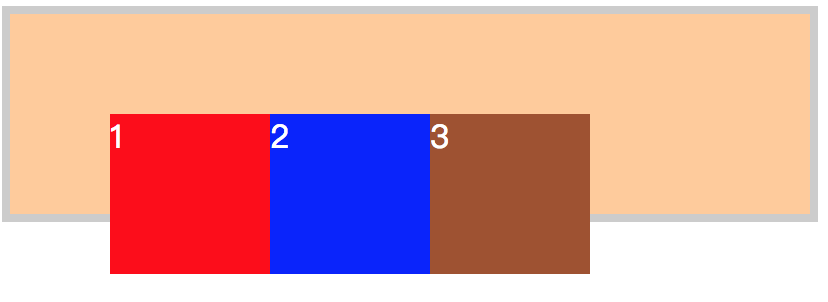
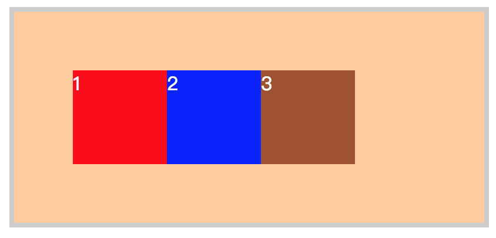
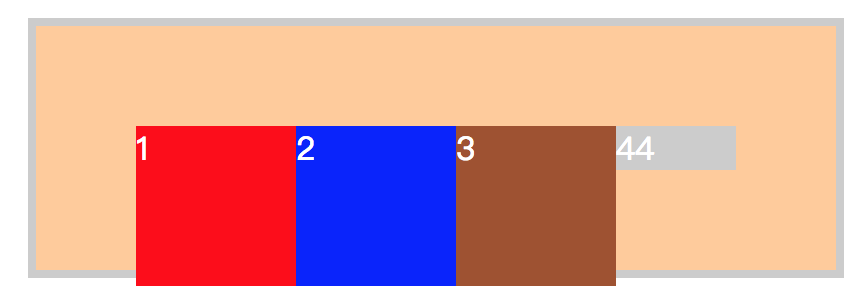
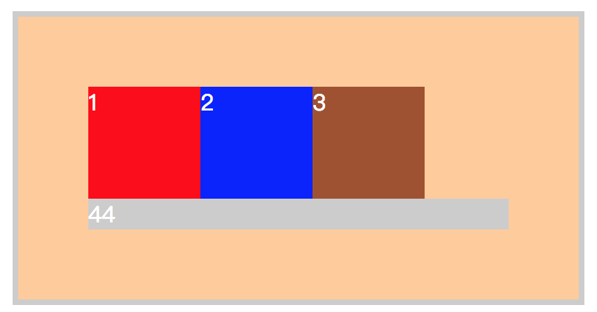

*摘要: css清除浮动float的三种方法总结，为什么清浮动？浮动会有那些影响？*

HTML代码：
```
<div class=“outer”>       
    <div class="div1">1</div>    
    <div class="div2">2</div>    
    <div class="div3">3</div>
</div>
```

CSS代码：
```
.outer{border: 4px solid #ccc;background: #fc9;color: #fff; margin: 50px auto;padding: 50px;} 
.div1{width: 80px;height: 80px;background: red;float: left;}
.div2{width: 80px;height: 80px;background: blue;float: left;}
.div3{width: 80px;height: 80px;background: sienna;float: left;}
```
效果图：margin、padding和border正常显示了，没设置height，height为0。


**影响一：这里我没有给最外层的DIV.outer 设置高度，但是我们知道如果它里面的元素不浮动的话，那么这个外层的高是会自动被撑开的，height就不会是0。但是当内层元素浮动后,外层的高不能被撑开，所以height仍然为0。（后面还会提到一种影响）**

- 方式一
最简单常见的方式就是在浮动元素后面添加新的空元素，新的空元素应用clear:both。
如下：
```
<div class="outer">
    <div class="div1">1</div>
    <div class="div2">2</div>
    <div class="div3">3</div>
    <div style="clear: both;"></div>
</div>
```
结果：height被自动撑开。（当然，如果你知道外层div的高度，显示的设置它的height也可以。）

- 方式二：父级div应用overflow:auto;
如下：
```
<div class="outer" style="overflow: auto; zoom: 1;">
    <div class="div1">1</div>
    <div class="div2">2</div>
    <div class="div3">3</div>
</div>
```
结果：`style="overflow: auto; zoom: 1;”`   //zoom: 1是处理兼容问题的

- 方式三

高大上的方法是给父级元素用`:after`
如下：
```
.outer {zoom:1;}    /*==for IE6/7 Maxthon2==*/
.outer:after {clear:both;content:'.';display:block;width: 0;height: 0;visibility:hidden;}   /*==for FF/chrome/opera/IE8==*/
```
结果：


**影响二：这是浮动的第二个影响
描述：在浮动元素后跟一个普通元素**
```
<div class="outer">
    <div class="div1">1</div>
    <div class="div2">2</div>
    <div class="div3">3</div>
    <div style="background: #cccccc;">44</div>
</div>
```
结果：第4个元素是个块级元素，按理应该是在div1的下面，但现在却浮动到了div3的右面。


清浮动：
就是使用上面的方式一的方法。只不过不需要添加新的空元素，直接在不需要浮动的第四个元素上应用clear:both
如下：
```
<div class="outer">
    <div class="div1">1</div>
    <div class="div2">2</div>
    <div class="div3">3</div>
    <div style="background: #cccccc; clear: both;">44</div>
</div>
```
结果：


