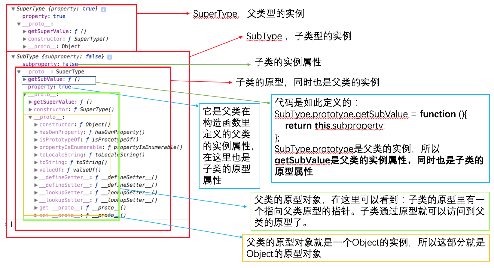
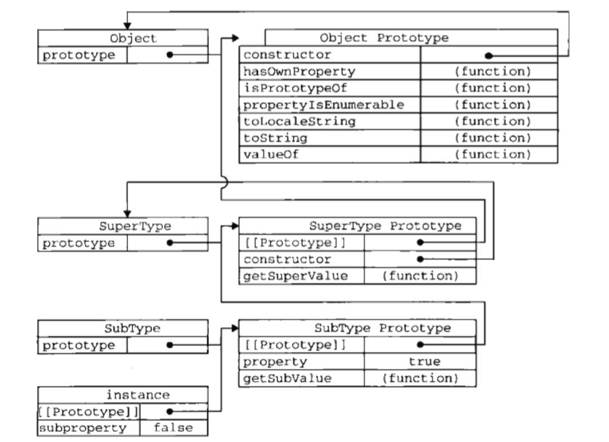
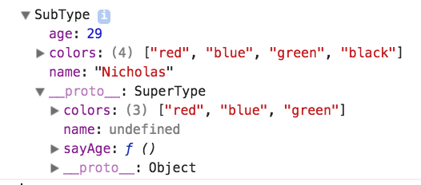
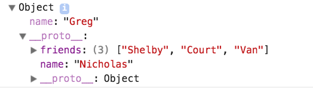
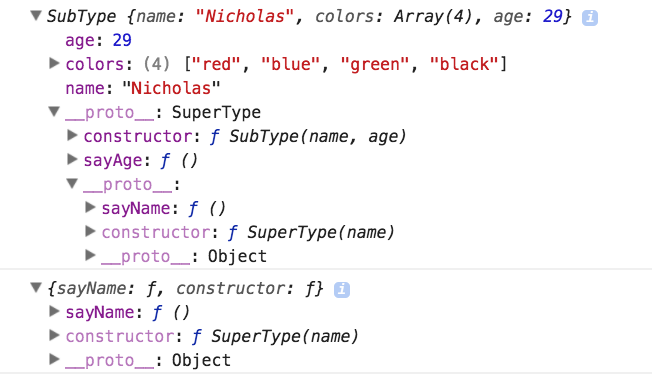

*读这篇之前，最好是已读过我前面的关于对象的理解和封装类的笔记。*

## 一、原型链
原型链最简单的理解就是：原型对象指向另一个构造函数的实例。此时的原型对象包括一个指向另一个原型的指针，相应的，另一个原型中的constructor指向另一个构造函数。这种关系层层递进，就通过一个原型对象链接另一个构造函数的原型对象的方式实现了继承。
下面用代码和图来详细分析一下原型链中的各种关系：
```
function SuperType(){
    this.property = true;
}

SuperType.prototype.getSuperValue = function(){
    return this.property;
};

function SubType(){
    this.subproperty = false;
}

//inherit from SuperType
SubType.prototype = new SuperType();

SubType.prototype.getSubValue = function (){
    return this.subproperty;
};

var instance = new SubType();
alert(instance.getSuperValue());   //true
alert(instance.getSubValue());   //false
alert(instance instanceof Object);      //true
alert(instance instanceof SuperType);   //true
alert(instance instanceof SubType);     //true

alert(Object.prototype.isPrototypeOf(instance));    //true
alert(SuperType.prototype.isPrototypeOf(instance)); //true
alert(SubType.prototype.isPrototypeOf(instance));   //true
console.log(new SuperType());
console.log(instance);
```
下图是上面代码中打印出来的new SuperType()和instance的分析：

从上面的分析我们看到的原型链：
SubType的原型里有指向SuperType的原型的指针，SuperType的原型里有指向Object的原型的指针。
也可以看红皮书里的图：

- 访问属性的搜索过程：
当以读取模式访问一个构造函数（SubType）的实例的属性时，首先会在实例中搜索实例属性。如果没找到该属性，则会继续搜索实例的原型；SubType继承了SuperType，那么实例的原型是另一个构造函数（SuperType）的实例，搜索实例的原型也就是在SuperType的实例中搜索该属性，没找到继续搜索SuperType的原型；SuperType继承了Object，以此递进，一层层搜索，直到找到或者搜到了原型链的末端停下来。
- 判断原型和实例的关系

(1)instanceof
实例的原型链中出现过待检测的构造函数，就会返回true
```
alert(instance instanceof Object);      //true
alert(instance instanceof SuperType);   //true
alert(instance instanceof SubType);     //true
```
(2)isPrototypeOf()方法
待检测对象出现在instance的原型链中，就会返回true
```
alert(Object.prototype.isPrototypeOf(instance));    //true
alert(SuperType.prototype.isPrototypeOf(instance)); //true
alert(SubType.prototype.isPrototypeOf(instance));   //true
```
- 注意事项

(1)给原型添加方法的代码一定要放在替换原型的语句之后。也就是
```
SubType.prototype = new SuperType();这句代码一定要先写，在写下面的代码
//new method
SubType.prototype.getSubValue = function (){
    return this.subproperty;
};

//override existing method
SubType.prototype.getSuperValue = function (){
    return false;
};
```
(2)在通过原型链实现继承时，不能使用对象字面量为原型添加属性，因为这会重写原型链（具体请看理解对象篇里的一、创建对象）。
如下：
```
function SuperType(){
    this.property = true;
}

SuperType.prototype.getSuperValue = function(){
    return this.property;
};

function SubType(){
    this.subproperty = false;
}

//继承了 SuperType
SubType.prototype = new SuperType();

//使用字面量添加新方法，会导致上一行代码无效
SubType.prototype = {
    getSubValue : function (){
        return this.subproperty;
    },

    someOtherMethod : function (){
        return false;
    }
};

var instance = new SubType();
alert(instance.getSuperValue());   //error!
```
其实这两个注意事项，只要你明白了（理解对象篇里的一、创建对象）后，根本不需要解释。
- 原型链的问题

(1)没有办法在不影响所有对象实例的情况下，给超类型的构造函数传递参数。

(2)在另一篇笔记封装类原型模式中提到过，原型中的属性是被共享的，但如果属性的值时引用类型，会有问题的。而在继承时，原型实际上会是另一个类型的实例（这个实例包含引用类型值的实例属性），那么原先的这个实例的实例属性就会成为现在的原型属性了，就会出现同样的问题了。共享了引用类型值的属性。
## 二、借用构造函数
直接上代码吧：
```
function SuperType(name){
    this.name = name;
}

function SubType(){ 
    //继承了 SuperType ，同时还传递了参数
    SuperType.call(this, "Nicholas");
   
    //实例属性
    this.age = 29;
}

var instance = new SubType();
alert(instance.name);    //"Nicholas";
alert(instance.age);     //29
```
如上写法就解决了原型链里的两个问题了，为什么呢？请看下面的讲解：
**SuperType，如果你用new调用它是构造函数，但你不用new，它就是个普通函数。SuperType.call(this, "Nicholas");不但传递了参数，还绑定了子类的作用域，就相当于SuperType方法在帮助定义子类的实例属性。也就是说，即使SuperType的中定义的属性里有引用类型值，也不会成为子类SubType的原型属性，仍然时实例属性。我们要时刻记住实例属性是每个实例所私有的，而原型属性是会被所有实例所共享的。**

当然这也写也不完美，问题显而易见，和构造函数模式同样的问题。
## 三、组合继承
组合继承，就像是封装类里的把构造函数模式和原型模式组合使用是一样的。这里是把原型链和借用构造函数相组合。
简单来说就是：**使用原型链实现对原型属性和方法的继承，通过借用构造函数实现对实例属性的继承（父类的实例属性变成子类的实例属性）。**
还是上代码吧：
```
function SuperType(name){
    this.name = name;    this.colors = ["red", "blue", "green"];}

SuperType.prototype.sayName = function(){
    alert(this.name);};function SubType(name, age){ 
    SuperType.call(this, name);       this.age = age;}

SubType.prototype = new SuperType();SubType.prototype.sayAge = function(){
    alert(this.age);};var instance1 = new SubType("Nicholas", 29);instance1.colors.push("black");alert(instance1.colors);  //"red,blue,green,black"instance1.sayName();      //"Nicholas";instance1.sayAge();       //29
var instance2 = new SubType("Greg", 27);alert(instance2.colors);  //"red,blue,green"instance2.sayName();      //"Greg";instance2.sayAge();       //27
```
解释:
下图是instance1的打印

**我们可以看到instance1具有了父类SuperType的实例属性name 、colors，但是子类的原型是父类的实例，所以原型中仍存在父类的实例属性，但是子类已经有了同样的实例属性name和colors，所以子类原型中的这两个属性就被屏蔽了。从子类访问它的name和colors属性只会访问到它的实例属性。**

组合继承是javaScript中最常用的继承模式。而且instance和isPrototypeOf()也能够用于识别给予组合继承创建的对象类型。
## 四、原型式继承
感兴趣可以了解一下。
原型链中，我们是让原型对象指向一个构造函数的实例，这个实例本质上就是一个对象。原型式继承就是让原型对象指向一个已有的对象，不必创建自定义类型。如下：
```
function object(o){
    function F(){}
    F.prototype = o;
    return new F();
}
var person = {
    name: "Nicholas",
    friends: ["Shelby", "Court", "Van"]
};

var anotherPerson = object(person);
anotherPerson.name = "Greg";
anotherPerson.friends.push("Rob");

var yetAnotherPerson = object(person);
yetAnotherPerson.name = "Linda";
yetAnotherPerson.friends.push("Barbie");
console.log(person.friends);   //"Shelby,Court,Van,Rob,Barbie”
```
大家还记得原型模式吗。我的理解：这就是一个原型模式，区别是object这个方法就相当于一个工厂，你传给它一个对象，它就给你一个原型是这个对象的实例。这个实例就会相应的继承到了你传给它的那个对象的属性。
当然你也可以不用自己写上面的object这个方法，因为ES5提供了，而且更规范。ES5中新增了`Object.create()`方法规范化了原型式继承。这个方法接受两个参数：一个是用做新对象原型的对象和（可选）一个为新对象定义额外属性的对象*(或者说是定义新对象的实例属性的对象，这个参数和defineProperties()方法的第二个参数格式相同：每个属性都是通过自己的描述符定义的)*。
上代码：
```
var person = {
    name: "Nicholas",
    friends: ["Shelby", "Court", "Van"]
};
                  
var anotherPerson = Object.create(person, {
    name: {
        value: "Greg"
    }
});
console.log(anotherPerson);
```
打印结果图：

从上图可以看到第二个参数定义的name属性是新对象的实例属性，它会屏蔽掉它的原型属性里的同名属性name。简单来说，Object.create就是用原型模式创建新对象的一个工厂，第一个参数定义了原型属性，第二个参数定义了实例属性。
## 五、寄生式继承
这一小节，感兴趣了解一下。

## 六、寄生组合式继承
**前面说过，组合继承是js里最常用的继承模式，但是它并不完美。问题是：调用了两次超类SuperType的构造函数，子类创建了一部分多余的属性（这部分属性是超类的实例属性，在子类的实例属性里存在并有用，但在子类的原型中也存在且没用）。寄生组合式继承就是解决这个问题的。**
上代码：
```
function object(o){
    function F(){}
    F.prototype = o;    
    return new F();
}

function inheritPrototype(subType, superType){
    var prototype = object(superType.prototype);   //create object    
    prototype.constructor = subType;               //augment object    
    subType.prototype = prototype;                 //assign object
}
                       
function SuperType(name){
    this.name = name;    
    this.colors = ["red", "blue", "green"];
}

SuperType.prototype.sayName = function(){
    alert(this.name);
};
function SubType(name, age){ 
    SuperType.call(this, name);
    this.age = age;
}

inheritPrototype(SubType, SuperType);
SubType.prototype.sayAge = function(){
    alert(this.age);
};

var instance1 = new SubType("Nicholas", 29);
instance1.colors.push("black");
alert(instance1.colors);  //"red,blue,green,black"
instance1.sayName();      //"Nicholas"
instance1.sayAge();       //29var 
instance2 = new SubType("Greg", 27);
alert(instance2.colors);  //"red,blue,green"
instance2.sayName();      //"Greg"
instance2.sayAge();       //27
console.log(instance1);
console.log(SuperType.prototype);
```
代码运行打印结果图：

从图中可以看到instance1（子类实例）的原型里已经没有了超类的实例属性name、colors。而且代码中只运行了一次超类构造函数。怎么做到的呢？请看下面的解释：
我们先看这段代码：
```
function inheritPrototype(subType, superType){
    var prototype = object(superType.prototype);   //create object
    prototype.constructor = subType;               //augment object
    subType.prototype = prototype;                 //assign object
}
```
subType的原型还是指向了一个对象，这个对象是什么呢？object这个方法返回的对象，这个对象是一个构造函数是空的，原型指向超类原型的实例。什么意思呢？就是说subType的原型还是一个构造函数的实例，但不是超类SuperType的实例，而是一个新建的临时的空的构造函数F的实例。看代码：
```
function object(o){
    function F(){}
    F.prototype = o;
    return new F();
}
```
这个临时的构造函数F具有和超类SuperType一样的原型。那么这个时候的子类的原型中就只有F的实例属性和原型，而F的实例属性是空的，就只有F的原型，F的原型就是超类SuperType的原型。这样子类的实例属性还是继承了超类的实例属性，而子类的原型属性只继承了超类的原型。完美，就这样。

啰嗦一句我对面向对象程序设计的理解，面向对象程序设计就是一直在说如何使用对象。其实，只要结果符合你的预期，对象真的是想怎么使用就怎么使用，不一定非得像书中说的什么各种模式的。当然书中的这么多种模式方法的介绍可以了解一下*（但是构造函数模式、原型模式。以及继承里的原型链、借用构造函数。还包括它们的组合使用还是需要认真研读，深刻理解的。再顺便说一句，继承里的原型链、借用构造函数可以看作是原型模式和构造函数模式的进化）*，可以加深自己对对象的理解，有助于你花式使用对象的方法。哈哈哈